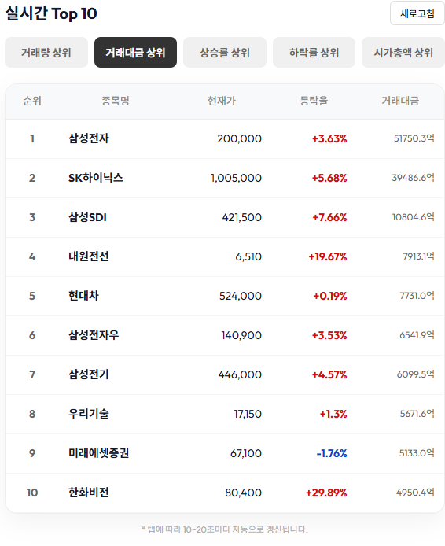

# DOYOUKNOWJU (두유노우주) - 모의투자 웹 서비스

팀 프로젝트 결과물을 **포트폴리오용으로 정리한 저장소**입니다.  
가상 투자(모의투자) 환경에서 주식 데이터를 조회하고, **게임 요소(랭킹/퀴즈/도전과제/칭호)**와  
**커뮤니티(게시판/채팅)** 기능을 결합해 “학습 + 재미 + 참여”를 강화한 서비스입니다.

- Team: 김동건 / 민경찬 / **유근영(본인)** / 임유택
- Original Repository: [팀장 레포 URL(선택)]
- Final Presentation: [docs/FinalProject.pdf](docs/FinalProject.pdf)

---

## 목차
- 프로젝트 개요
- 담당 구현 (유근영)
- 기능 시연 (Screenshots)
- 백엔드 구조 요약
- Tech Stack
- 실행 방법
- 포트폴리오 안내

---

## 프로젝트 개요
- 목표: 초보 투자자도 부담 없이 **모의투자 경험**을 쌓고, 커뮤니티 기반으로 정보를 공유할 수 있는 서비스
- 특징: 실시간성 데이터(Top10/지수 차트) + 커뮤니티(게시판/채팅) + 게임 요소(랭킹/퀴즈/칭호)

---

## 담당 구현 (유근영)
포트폴리오 관점에서 제가 기여한 영역은 아래와 같습니다.

### 1) 주식 Top10
- 거래량/거래대금/등락률/시가총액 기반 Top10 제공
- 빠른 시장 탐색을 위한 메인 컴포넌트 역할

### 2) 코스피/코스닥 지수 차트
- 코스피/코스닥 전환 + 기간 전환(실시간/일/주/월/년)
- 지수 흐름을 직관적으로 확인 가능

### 3) 커뮤니티(게시판/종목토론방)
- 자유게시판 + 종목토론방
- 종목토론방: 종목 검색/필터 적용으로 특정 종목 글만 탐색

### 4) 종목 검색(자동완성 + 검색결과)
- 종목명/종목코드 자동완성 제공
- 검색 결과에서 종목 리스트 및 가격/등락 정보 제공

### 5) 인기글/마이페이지(작성 글/댓글)
- 인기글(실시간/주간) 노출로 커뮤니티 유입 강화
- 마이페이지에서 작성 글/댓글 확인 UX 제공

---

## 기능 시연 (Screenshots)

### 종목토론방: 종목 검색 + 실시간 인기 종목
.png)

### 게시판 목록
.png)

### 종목토론방: 종목 필터 적용
.png)

### 지수 차트: 코스닥
.png)

### 지수 차트: 코스피
.png)

### 실시간 Top10: 거래량
.png)

### 실시간 Top10: 거래대금

### 검색: 자동완성
.png)

### 검색: 결과 화면
.png)

### 마이페이지: 작성 글/댓글
.png)

### 인기글(실시간/주간)
.png)

---

## 백엔드 구조 요약
도메인 단위로 패키지를 분리하여 기능 확장/유지보수성을 고려했습니다.

- `domain/stock` : 관심종목/보유/매매/거래내역 + KIS 연동
- `domain/ranking` : 랭킹/Top10 및 스케줄러
- `domain/board` : 게시판/댓글/필터링/인기글
- `domain/news` : 뉴스 수집/스케줄러
- `domain/chat` : WebSocket 채팅
- `common/config` : Web/Cors/Security/WebSocket 설정

---

## Tech Stack
- Backend: Java, Spring Boot
- DB/ORM: [Oracle XE 등] + MyBatis(XML Mapper)
- Realtime: WebSocket
- External: KIS OpenAPI, Naver 데이터 연동

